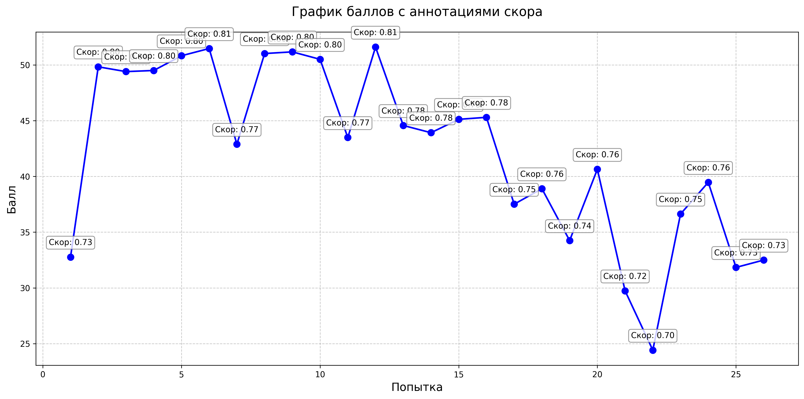
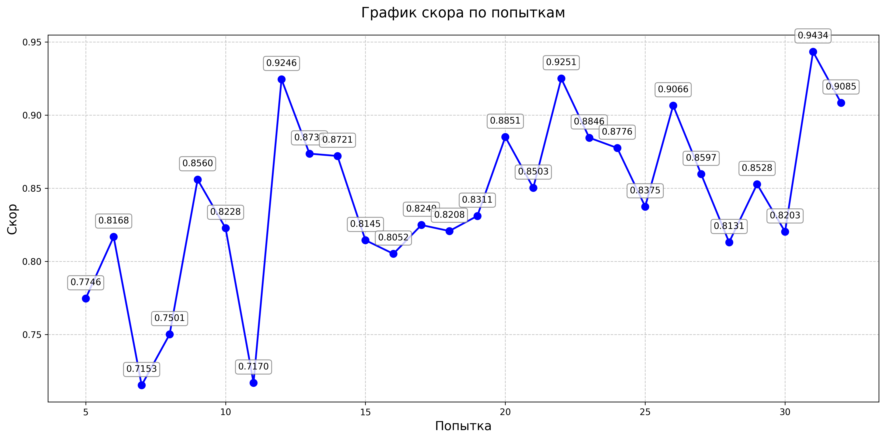

# sber ai hack 

## Task: Студенты. Клик или нет?

#### Предыстория

Команда студентов из Новосибирского государственного университета разрабатывает алгоритмы для рекламной платформы «Сибирский клик». Анализируя данные о показах рекламы, они стремятся предсказать, кликнет ли пользователь по объявлению, чтобы оптимизировать таргетинг.
Вас отобрали в команду — поздравляем! Теперь вам предстоит обработать большой массив данных и создать модель для предсказания вероятности клика.

### Что нужно сделать

По категориальным признакам из данных о показах рекламы предсказать вероятность клика (целевой признак: 0 или 1).

#### Результаты обучения моделей (нужно набрать 0.85)

## Task: Студенты.Природа раскрывает секреты

#### Предыстория

Команда студентов из Новосибирского государственного университета разрабатывает алгоритмы для рекламной платформы «Сибирский клик». Анализируя данные о показах рекламы, они стремятся предсказать, кликнет ли пользователь по объявлению, чтобы оптимизировать таргетинг.
Вас отобрали в команду — поздравляем! Теперь вам предстоит обработать большой массив данных и создать модель для предсказания вероятности клика.

### Что нужно сделать

По фотографии отпечатка определить, какому из шести видов животных принадлежит след: медведь, птица, кошка, волк, выдра или леопард.

#### Результаты обучения моделей (нужно набрать 0.95)

